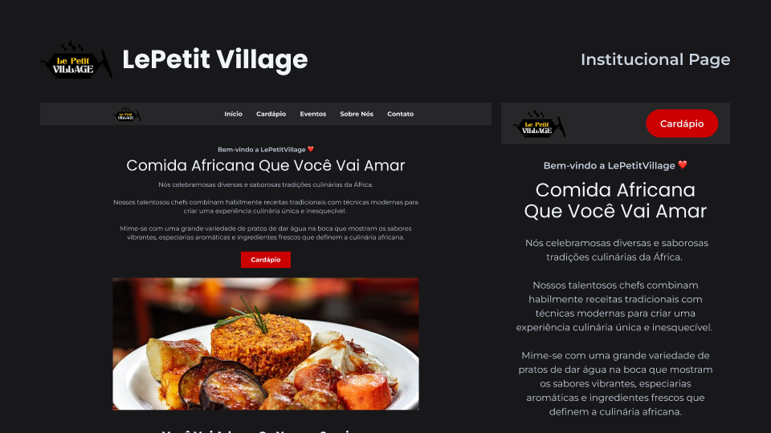
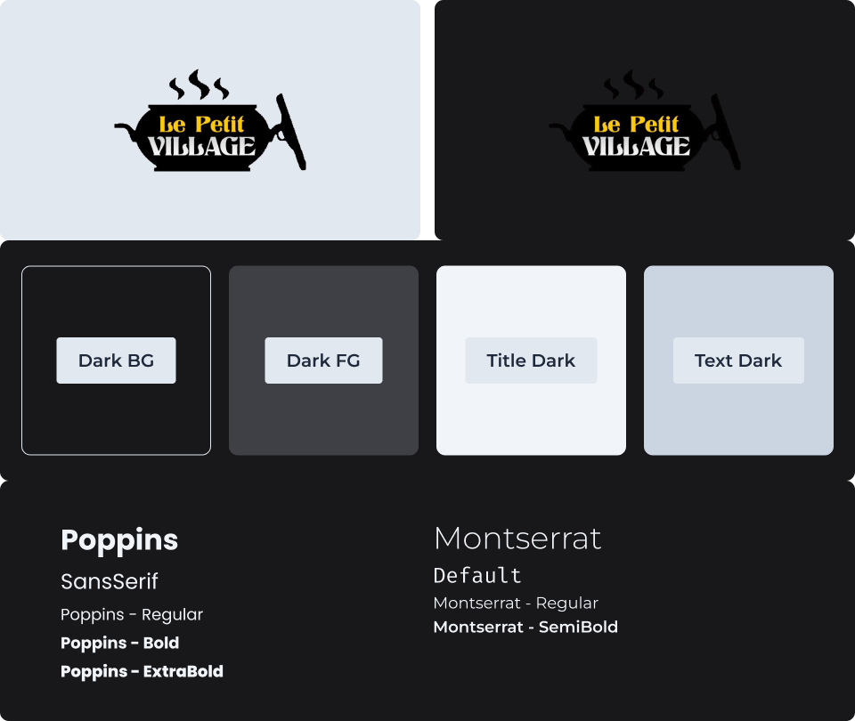

# [🦐 Le Petit Village](https://lepetitvillage.com.br/) <!-- omit in toc --> 

🦐 Um site institucional de um restaurante com influências africanas.

   | [Sobre O Projeto](https://evonofy.notion.site/Le-Petit-Village-Sobre-O-Projeto-bc156052ff7a48f4aa6c54d357f1a768?pvs=4) | 
   | ---------------------------------------------------------------------------------------------------------------------- |

   
   

## 📖 `Sumário` <!-- omit in toc -->

- [🏷️ `Recursos`](#️-recursos)
- [📜 `Propósito`](#-propósito)
- [👨‍💻 `Tecnologias E Pacotes`](#-tecnologias-e-pacotes)

### 🏷️ `Recursos`
- Página inicial com empregação de *motion design*, efeitos visuais com movimento.
- Menu contando com todos pratos e bebidas do restaurante.
- Página de eventos com formulário com pré-formatação para o *whatsapp*.

### 📜 `Propósito`
Criar uma página institucional elegante e caseira com essenciais africanas para a Le Petit Village.

### 👨‍💻 `Tecnologias E Pacotes`

 
   
   
   

 

- [Yarn](https://yarnpkg.com/)

[⬆ De Volta Ao Topo](#-le-petit-village)